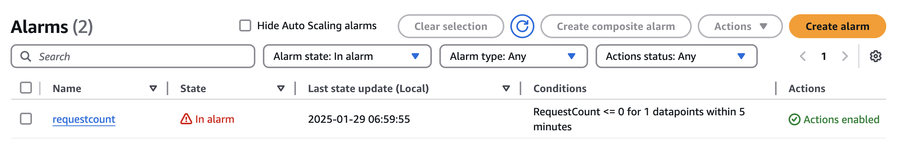
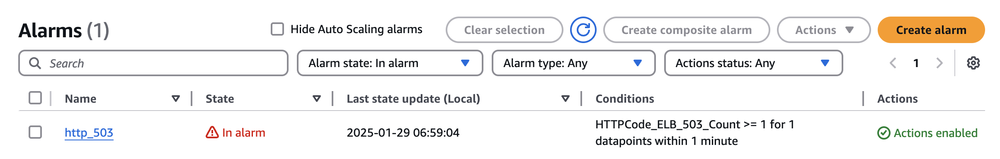
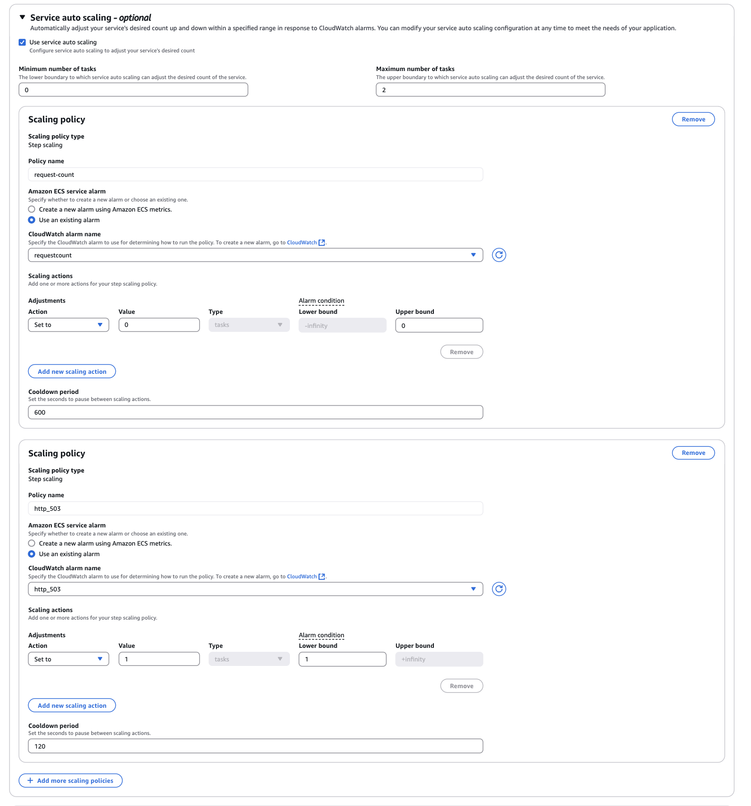
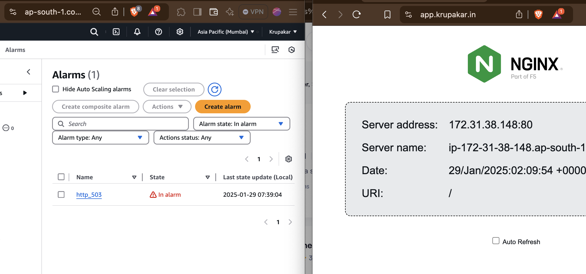
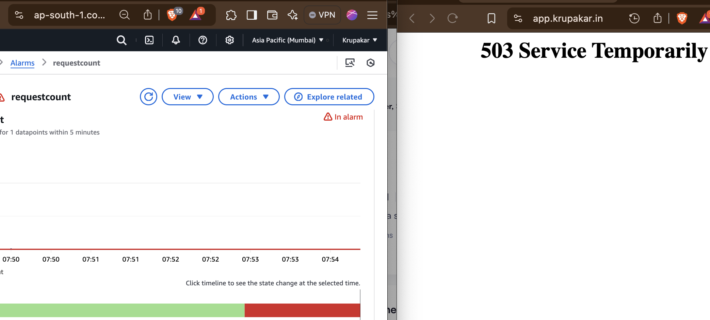

## ECS Service Scaling Based on HTTP Traffic

This README covers how to set up an ECS service and task with an autoscaling policy based on incoming traffic.

#### Objective:

The primary goal is cost optimization by scaling down to zero tasks during non-business hours and scaling up dynamically when traffic increases. This ensures efficient cloud cost management.

-------------------
#### Introduction:
For non-critical services that run continuously without being utilized throughout the day, unnecessary cloud costs can accrue.

- Particularly in AWS, running a service on EC2 instances rather than Fargate can lead to significant expenses.

- To optimize costs, autoscaling policies can be used to dynamically adjust resources based on demand.

#### Scaling Policies in ECS

AWS ECS offers multiple scaling strategies:

- Target Tracking Scaling : Adjusts capacity to maintain a specific CloudWatch metric (e.g., CPU utilization).

- Step Scaling : Uses predefined thresholds and CloudWatch alarms to trigger scaling actions.

- Predictive Scaling : Uses machine learning to predict future traffic and scale accordingly.

#### Why Step Scaling?

While cron-based scheduled scaling allows scaling at predefined times, it is not ideal for applications that need to be available dynamically based on real-time traffic.

- Step scaling based on CloudWatch metrics is preferred as it allows scaling up whenever traffic increases and scaling down when traffic is low or non-existent.

- If your service is behind a Load Balancer (LB), you can leverage LB HTTP metrics for scaling.

- If no LB is used, custom metrics can be pushed to CloudWatch (e.g., via monitoring tools and exporters).

- Once CloudWatch metrics are set up, alarms can trigger appropriate scaling actions.

-------------------

#### Setup
- Manual Configuration via AWS Console, 
(Above terraform files to create the whole setup except cloudwatch metrics,alarms and scaling configuration. - WIP)

##### Steps to Set Up Autoscaling in ECS:

1. Create an ECS Cluster.

2. Define an ECS Task Definition with necessary fields (container name, image, etc.).

3. Create an ECS Service using an appropriate launch type.

4. Attach a Load Balancer to capture HTTP traffic metrics.

#### Set Up CloudWatch Metrics & Alarms:

Using LB metrics, configure HTTP `request count` per target as the scaling metric.

If no LB, push custom traffic metrics to CloudWatch.

--------------
Define thresholds for scaling up (e.g., when HTTP requests exceed a certain limit).

Define thresholds for scaling down (e.g., when traffic drops to near zero).

Test the Autoscaling Setup by generating traffic and monitoring the response.

---------------

- Configure Step Scaling Policy:

Here my requirement is to scale-down to zero tasks when there is no-requests/zero-requests, hence i'll consider `requestcount` metric of LB.
- create an alarm for requestcount metric with required-time, for e.g:

- similarly for scale-up metric, will consider `HTTPCode_ELB_503_Count` metric, since when service is down, 503 is response. 
create an alarm for HTTPCode_ELB_503_Count metric to scale-up, when requests starts.

Once Metrics alarms are created in cloudwatch, now time to configure scaling-policy in ECS tasks. Step-scaling is suitable policy for our requirement.

- Create scaling policies for scale-up and scale-down as show below:

Once scaling policies are configured as per above, the scaling works as if there is no requests/zero-requests in 5 minutes, servce scales to `0`. if there is one request starts, service starts scale-up and will be available in `~2`minutes

----------------

- During No Requests :

In above image, app was in down state which is 503, when reqests starts increase, `http_503` alarm is triggered to scale-up and app is available.

Similarly, when requests are zero, `requestcount` alarm triggered to scale-down to 0 tasks.

